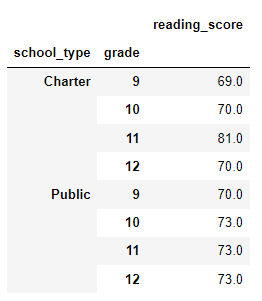
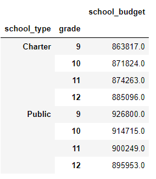

# School_District_Analysis

## **Overview of School District Analysis**

### To assist Maria in performing an analysis for the schoold district by using the new dataset.

## **Summary**

- **Discoveries from the analysis**

  * While comparing the district and charter schools, we observed that public schools generally had more budget than charter schools. However, they had lower average reading and math scores compared with charter schools. As investigated further in the average math score by grade for each school type, we saw that charter schools had better scores than public schools except for the 12th grade.

- **Additional analysis**

  * We can perform a similar study on the average reading score by grade for each school type. Please see below for details. As shown, public schools had relatively higher reading scores than charter schools except for the 11th grade.

    
  
  * Similarly, we can study the average budget by grade for each school type. Please see below for details.

    
